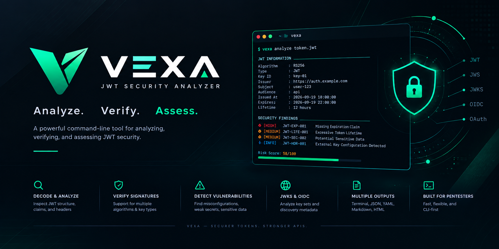

**Vexa** is a command-line JWT security analyzer designed for security assessment, penetration testing, and application security testing.

It analyzes JWT structure, headers, claims, algorithms, signatures, token lifetime, sensitive data exposure, and other security-relevant configurations.

> **Vexa is intended for authorized security testing, research, development, and educational purposes.**

---

## Features

### JWT Analysis

* JWT structure validation
* Header decoding
* Payload decoding
* Signature inspection
* Base64URL validation
* JSON structure validation
* Duplicate claim detection

### Algorithm Security

* Algorithm identification
* `alg: none` detection
* Symmetric/asymmetric algorithm analysis
* Algorithm and key compatibility checks
* Unsupported/deprecated algorithm detection

### Claim Analysis

Analyzes standard JWT claims:

```text
iss
sub
aud
exp
iat
nbf
jti
```

Also supports analysis of custom claims.

Checks include:

* Missing expiration
* Invalid expiration
* Expired tokens
* Invalid timestamps
* Excessive token lifetime
* Inconsistent temporal claims
* Suspicious custom claims

### Sensitive Data Detection

Detects potential sensitive information inside JWT payloads, including patterns related to:

```text
password
secret
token
api_key
private_key
authorization
credit_card
```

Sensitive values can be masked in reports.

### Signature Verification

Supports verification using user-provided keys or secrets.

Example:

```bash
vexa verify token.jwt --public-key public.pem
```

Supported algorithms include:

```text
HS256
HS384
HS512

RS256
RS384
RS512

ES256
ES384
ES512
```

### Security Findings

Vexa converts analysis results into structured findings containing:

```text
ID
Title
Severity
Confidence
Description
Evidence
Impact
Remediation
References
```

Severity levels:

```text
CRITICAL
HIGH
MEDIUM
LOW
INFO
```

### JWKS Analysis

Analyze JSON Web Key Sets and match JWT keys using `kid`.

```bash
vexa jwks https://example.com/.well-known/jwks.json
```

Capabilities include:

* `kid` matching
* Key type analysis
* Algorithm matching
* Signature verification
* Key configuration analysis
* Key rotation analysis

### OIDC Analysis

Vexa can analyze OpenID Connect discovery metadata.

```bash
vexa oidc https://auth.example.com
```

It can inspect:

```text
issuer
jwks_uri
id_token_signing_alg_values_supported
response_types_supported
grant_types_supported
scopes_supported
claims_supported
```

### Token Comparison

Compare two JWTs:

```bash
vexa compare token1.jwt token2.jwt
```

Useful for analyzing differences between:

* User tokens
* Admin tokens
* Access tokens
* Tokens generated before/after authentication changes

### Batch Analysis

Analyze multiple tokens:

```bash
vexa batch ./tokens/
```

### Reporting

Supported output formats:

```text
Terminal
JSON
YAML
Markdown
HTML
```

Example:

```bash
vexa analyze token.jwt --json
```

or:

```bash
vexa analyze token.jwt --html report.html
```

---

# Installation

## From Source

Clone the repository:

```bash
git clone https://github.com/yourusername/vexa.git
cd vexa
```

Set up a virtual environment (recommended):

```bash
python -m venv venv
source venv/bin/activate  # On Windows use: venv\Scripts\activate
```

Install the package and its dependencies:

```bash
pip install -e .
```

Run:

```bash
vexa --help
```

---

# Quick Start

Analyze a JWT:

```bash
vexa analyze token.jwt
```

Decode a JWT:

```bash
vexa decode token.jwt
```

Verify a JWT:

```bash
vexa verify token.jwt --public-key public.pem
```

Compare tokens:

```bash
vexa compare token1.jwt token2.jwt
```

Analyze a JWKS endpoint:

```bash
vexa jwks https://example.com/.well-known/jwks.json
```

Analyze an OIDC issuer:

```bash
vexa oidc https://auth.example.com
```

Generate JSON output:

```bash
vexa analyze token.jwt --json
```

Generate HTML report:

```bash
vexa analyze token.jwt --html report.html
```

---

# Example

Running:

```bash
vexa analyze token.jwt
```

may produce:

```text
Vexa JWT Security Analyzer
────────────────────────────────────────

JWT Information
────────────────────────────────────────
Algorithm : RS256
Type      : JWT
Key ID    : key-01
Issuer    : https://auth.example.com
Subject   : user-123
Audience  : api
Lifetime  : 12 hours

Security Findings
────────────────────────────────────────

[HIGH] JWT-EXP-001
Missing Expiration Claim

Confidence: HIGH

[MEDIUM] JWT-LIFE-001
Excessive Token Lifetime

Confidence: HIGH

[MEDIUM] JWT-SEC-002
Potential Sensitive Data

Confidence: MEDIUM

[INFO] JWT-HDR-001
External Key Configuration Detected

Confidence: MEDIUM

────────────────────────────────────────

Total Findings : 4

CRITICAL : 0
HIGH     : 1
MEDIUM   : 2
LOW      : 0
INFO     : 1

Risk Score : 58/100
```

---

# CLI Commands

Vexa uses a command-based CLI structure:

```text
vexa
├── decode
├── analyze
├── verify
├── compare
├── batch
├── jwks
├── oidc
├── report
└── version
```

## Decode

Decode JWT header and payload.

```bash
vexa decode token.jwt
```

## Analyze

Perform security analysis.

```bash
vexa analyze token.jwt
```

Optional lifetime threshold:

```bash
vexa analyze token.jwt --max-lifetime 3600
```

## Verify

Verify JWT signature.

```bash
vexa verify token.jwt --public-key public.pem
```

For HMAC:

```bash
vexa verify token.jwt --secret secret.txt
```

## Compare

Compare two tokens:

```bash
vexa compare token1.jwt token2.jwt
```

## Batch

Analyze multiple tokens:

```bash
vexa batch ./tokens/
```

## JWKS

Analyze a JWKS endpoint:

```bash
vexa jwks https://example.com/.well-known/jwks.json
```

## OIDC

Analyze an OIDC issuer:

```bash
vexa oidc https://auth.example.com
```

## Report

Generate a report:

```bash
vexa report result.json --format html
```

---

# Architecture

Vexa follows a modular architecture:

```text
                    ┌───────────────┐
                    │      CLI      │
                    └───────┬───────┘
                            │
                            ▼
                    ┌───────────────┐
                    │ Command Layer │
                    └───────┬───────┘
                            │
                            ▼
                    ┌───────────────┐
                    │ Input Manager │
                    └───────┬───────┘
                            │
                            ▼
                    ┌───────────────┐
                    │  JWT Parser   │
                    └───────┬───────┘
                            │
             ┌──────────────┼──────────────┐
             │              │              │
             ▼              ▼              ▼
       ┌──────────┐   ┌───────────┐   ┌──────────┐
       │Validator │   │ Analyzer  │   │ Verifier │
       └────┬─────┘   └─────┬─────┘   └────┬─────┘
            │               │              │
            └───────────────┼──────────────┘
                            ▼
                    ┌───────────────┐
                    │Finding Engine │
                    └───────┬───────┘
                            │
                            ▼
                    ┌───────────────┐
                    │  Risk Scoring │
                    └───────┬───────┘
                            │
                            ▼
                    ┌───────────────┐
                    │   Reporter    │
                    └───────┬───────┘
                            │
              ┌─────────────┼─────────────┐
              ▼             ▼             ▼
          Terminal         JSON          HTML
```

---

# Project Structure

```text
vexa/
│
├── src/
│   └── vexa/
│       ├── __init__.py
│       ├── main.py
│       ├── cli.py
│       │
│       ├── parser.py
│       ├── decoder.py
│       ├── validator.py
│       │
│       ├── analyzers/
│       │   ├── __init__.py
│       │   ├── algorithm.py
│       │   ├── claims.py
│       │   ├── expiration.py
│       │   ├── headers.py
│       │   ├── sensitive.py
│       │   ├── structure.py
│       │   └── duplicate.py
│       │
│       ├── verifier.py
│       ├── jwks.py
│       ├── oidc.py
│       ├── engine.py       # Findings & Scoring
│       │
│       └── reporters/
│           ├── __init__.py
│           ├── terminal.py
│           ├── json_rep.py
│           ├── yaml_rep.py
│           ├── markdown.py
│           └── html.py
│
├── tests/
│   ├── unit/
│   ├── integration/
│   └── fuzz/
│
├── examples/
│
├── docs/
│
├── pyproject.toml
├── requirements.txt
├── Makefile
└── README.md
```

---

# Technology Stack

| Component    | Technology       |
| ------------ | ---------------- |
| Language     | Python 3.9+      |
| CLI          | Click / Typer    |
| JWT          | PyJWT            |
| HTTP         | requests / httpx |
| Cryptography | cryptography     |
| JSON         | json (built-in)  |
| HTML         | Jinja2           |
| Testing      | pytest           |
| Fuzzing      | Atheris          |
| Linter/Fmt   | Ruff / Black     |
| CI/CD        | GitHub Actions   |
| Container    | Docker           |

---

# Security Model

Vexa is designed around three operating modes.

## Passive

Performs local analysis only.

```bash
vexa analyze token.jwt
```

No external request is required.

## Verify

Uses keys or secrets explicitly provided by the user.

```bash
vexa verify token.jwt --public-key public.pem
```

## Assessment

Performs explicitly requested remote configuration analysis.

```bash
vexa assess token.jwt \
    --issuer https://auth.example.com
```

Remote analysis can include:

* OIDC discovery
* JWKS discovery
* Key matching
* Configuration analysis
* Signature verification

---

# Security Considerations

Vexa is designed primarily for **analysis and verification**, not automated exploitation.

The tool should:

* Avoid credential attacks against remote services.
* Avoid brute-force attacks against authentication endpoints.
* Require explicit input for remote assessment.
* Restrict remote URL access where appropriate.
* Prevent unsafe SSRF behavior when processing `jku` or `x5u`.
* Mask secrets in reports when possible.
* Apply HTTP timeouts.
* Validate redirects.
* Handle malformed JWTs safely.
* Avoid leaking sensitive token contents through logs.

Only test systems and tokens for which you have authorization.

---

# CI security gate

Use `jwt-analyzer` in a pipeline. The process exits 1 when a finding meets the severity threshold, so the job fails.

```bash
jwt-analyzer analyze token.jwt \
    --severity-threshold HIGH \
    --format json \
    --output report.json
```

Exit codes:

```text
0  no finding at or above the threshold
1  a finding meets the threshold
2  invalid input
3  configuration error
4  runtime error
```

`--ignore-rule JWT-EXP-001` suppresses one finding id. A YAML or JSON config file supplies defaults, and the flags above replace those defaults.

GitHub Actions runs the unit tests, the integration tests, and the parser fuzz corpus on every pull request (`.github/workflows/test.yml`). Coverage must stay above 80 percent.

---

# Testing

From `vexa_cli`:

```bash
python -m pip install -e ".[dev]"
python -m pytest
python -m pytest tests/unit tests/integration --cov=jwt_analyzer --cov-report=term-missing --cov-fail-under=80
python tests/fuzz/run_fuzz.py --seconds 300
```

The fuzz corpus in `tests/fuzz/corpus` holds malformed JWTs. The timed fuzzer mutates that corpus and checks that the parser, base64url decoder, JSON decoder, header analyzer, and claim analyzer do not crash.

---

# Development

Format code:

```bash
black .
# or
ruff format .
```

Run locally during development:

```bash
python -m src.vexa.main --help
```

Build or install locally:

```bash
pip install -e .
```

---

# Roadmap

## v0.1 — MVP

* [ ] CLI foundation
* [ ] JWT parser
* [ ] JWT decoder
* [ ] Structure validation
* [ ] Header analysis
* [ ] Claim analysis
* [ ] Algorithm analysis
* [ ] Expiration analysis
* [ ] Sensitive data detection
* [ ] Signature verification
* [ ] Severity classification
* [ ] Confidence classification
* [ ] Terminal output
* [ ] JSON output

## v0.2

* [ ] Weak-secret analysis
* [ ] Batch analysis
* [ ] Token comparison
* [ ] HTML report
* [ ] Markdown report
* [ ] YAML output
* [ ] Configuration file
* [ ] Finding suppression
* [ ] CI/CD integration

## v0.3

* [ ] JWKS analysis
* [ ] OIDC discovery
* [ ] OAuth/OIDC analysis
* [ ] Key rotation analysis
* [ ] Remote configuration analysis
* [ ] Finding correlation

## v1.0

* [ ] Plugin architecture
* [ ] SARIF output
* [ ] Advanced reporting
* [ ] CI/CD security gate
* [ ] Extensive test coverage
* [ ] Documentation
* [ ] Stable CLI interface

---

# Exit Codes

Vexa uses predictable exit codes:

| Code | Meaning                    |
| ---: | -------------------------- |
|  `0` | No security findings       |
|  `1` | Security findings detected |
|  `2` | Invalid input              |
|  `3` | Configuration error        |
|  `4` | Runtime error              |

This allows Vexa to be integrated into CI/CD pipelines.

Example:

```bash
vexa analyze token.jwt --severity-threshold HIGH
```

---

# Use Cases

Vexa can be used for:

### Penetration Testing

Analyze JWT implementations during web/API security assessments.

### API Security

Inspect authentication tokens used by REST APIs.

### Application Security

Identify insecure JWT configuration during development.

### Bug Bounty

Perform authorized JWT analysis during vulnerability research.

### DevSecOps

Integrate JWT security checks into CI/CD pipelines.

### Security Research

Experiment with JWT, JWS, JWKS, OAuth, and OIDC security mechanisms.

### Education

Learn how JWT authentication and common security issues work.

---

# Contributing

Contributions are welcome.

Before submitting a pull request:

1. Create or update tests.
2. Run `pytest`.
3. Run `ruff check .` to ensure code is clean.
4. Format the code using `black .` or `ruff format .`.
5. Update documentation when behavior changes.
6. Keep security-sensitive behavior explicit and documented.

---

# Disclaimer

Vexa is a security testing and research tool.

Use it only against applications, APIs, JWTs, keys, and infrastructure that you own or have explicit authorization to assess.

The maintainers are not responsible for unauthorized use or damage caused by the tool.

---

# License

This project is licensed under the MIT License.

See [`LICENSE`](LICENSE) for details.

---

# Project Status

**Status:** 🚧 Active Development

Vexa is currently under development. Features and CLI interfaces may change before the first stable release.

---

## Name

**Vexa** — JWT Security Analyzer

```text
Vexa
JWT Security Analyzer
────────────────────────────
Analyze. Verify. Assess.
```
